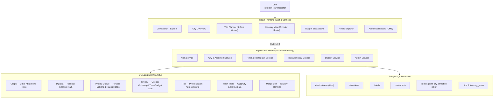

# Heritage Tourism Planner for Gujarat
> **Course:** CSC210 Introduction to Data Structures & Algorithms — Ahmedabad University  
> **Group:** Group 07  
> **Status:** Frontend Built & Verified | Architecture & Specification Complete

---

## Project Overview

The **Heritage Tourism Planner for Gujarat** is an intra-city algorithmic itinerary generator and budget optimization engine designed specifically for historic, cultural, and eco-tourism destinations across Gujarat, India. 

Commercial travel platforms focus primarily on inter-city transport booking or static multi-city packages, leaving tourists to manually figure out daily schedules inside a destination. Manual intra-city trip planning is inefficient—requiring users to balance physical road distances, attraction visit durations, realistic arrival/departure timestamps, compulsory meal breaks, accommodation costs, and strict budget caps.

Our system models each destination city as a dedicated spatial road graph and applies core Data Structures and Algorithms (DSA)—including **Graphs**, **Dijkstra's Shortest Path**, **Min-Heap Priority Queues**, **Tries**, **Hash Tables**, **Greedy Optimization**, and **Merge Sort**—to instantly generate minute-by-minute, budget-aware circular itineraries.

---

## Scope Statement (Intra-City Focus)

> [!IMPORTANT]
> **Single-City Scope Notice:** The user selects **one city at a time** from 8 fixed Gujarat heritage destinations (*Somnath, Dwarka, Rann of Kutch, Gir, Modhera, Champaner, Saputara, Ahmedabad*) and receives a **circular multi-day plan**:  
> $$\text{Hotel} \longrightarrow \text{Attractions} \longrightarrow \text{Hotel}$$  
> **There is no inter-city routing anywhere in this system.** Travel between cities is left entirely to the user. This single-city focus enables realistic road-graph modeling, precise time-budgeting, and a mathematically rigorous DSA demonstration.

---

## Key Features

- **Trie-Backed Autocomplete Search:** Instant $O(L)$ prefix search across cities and heritage attractions (`Dw` $\rightarrow$ `Dwarka`).
- **Circular Intra-City Itinerary Generation:** Builds day-by-day schedules starting and ending at the user's selected hotel with exact arrival/departure times.
- **Automated Meal Break Insertion:** Automatically injects 60-minute lunch (12:30 PM – 2:30 PM) and dinner (7:30 PM – 9:30 PM) windows without violating daily schedule bounds.
- **Hotel Suggestions & Priority Queue Ranking:** Recommends and ranks accommodation options based on user budget tier and rating-per-cost efficiency.
- **Interactive Budget Breakdown:** Provides dynamic itemized financial tracking across Hotels, Entry Fees, Meals, and Intra-City Transit.
- **Interactive Dijkstra Visualizer:** Features an educational step-by-step visualizer illustrating node relaxation, priority queue updates, and shortest-path construction.
- **Tour Operator Admin Dashboard:** CMS panel allowing tourism operators to manage destinations, attractions, hotels, and restaurants.
- **PDF Itinerary Export:** Instant single-click PDF generation of day-by-day itineraries using `jspdf` and `html2canvas`.

---

## System Architecture



---

## Data Structures & Algorithms (DSA Engine)

| DSA / Algorithm | Scope | Role in System | Technical Justification |
| :--- | :--- | :--- | :--- |
| **Graph (Adjacency List)** | Single City | Represents intra-city road network | Weighted, undirected spatial graph where vertices are hotels/attractions and edge weights represent travel time (mins) and road distance (km). |
| **Dijkstra's Algorithm** | Single City | Supporting Shortest-Path Finder | Computes the shortest path between two attractions in the same city when no direct road edge connects them directly. |
| **Priority Queue (Min-Heap)** | System-Wide | Node Selection & Efficiency Ranking | Powers $O(\log V)$ node extraction in Dijkstra and ranks hotels/attractions by rating-to-cost ratios. |
| **Trie (Prefix Tree)** | System-Wide | Autocomplete Search | Stores city and attraction names for fast $O(L)$ prefix lookups ($L = \text{query length}$) on search input. |
| **Hash Table (Map / Index)** | System-Wide | $O(1)$ Direct Entity Lookup | Maps confirmed city IDs to their attraction lists, hotels, and restaurant records for instant retrieval. |
| **Greedy Heuristic** | Single City | Itinerary Builder & Time Budgeting | Builds circular routes via nearest-neighbor, splits attractions across days by remaining time budget (not fixed count), and allocates money across categories. |
| **Merge Sort** | System-Wide | Custom Display Ranking | Sorts destinations, hotels, and attractions by rating, price, or distance in $O(N \log N)$ time. |

### What Dijkstra Does vs. What Greedy Does
- **Greedy Heuristic** is the *itinerary builder*: it decides the visiting sequence of attractions for the day, enforces time limits, and handles hotel return.
- **Dijkstra's Algorithm** is a *utility solver*: it calculates the true shortest road path between non-adjacent attractions when direct edges do not exist in the city graph.

---

## Repository Structure

```
group-07-heritage-tourism-planner/
├── Frontend/                        # Built & Verified React 19 Frontend
│   ├── src/
│   │   ├── components/             # React UI components (Itinerary, Dijkstra, Admin, etc.)
│   │   ├── data/                   # Heritage datasets & color tokens (Stepwell theme)
│   │   ├── App.tsx                 # Main application state & routing
│   │   ├── index.css               # Tailwind CSS v4 design system
│   │   └── main.tsx                # Application entry point
│   ├── package.json                # Frontend dependencies & scripts
│   ├── tsconfig.json               # TypeScript configuration
│   └── vite.config.ts              # Vite 6 build pipeline
├── docs/
│   └── foundation/                 # Comprehensive Academic Documentation
│       ├── 01_Project_Proposal.md  # University-level project proposal (20 sections)
│       ├── 02_System_Architecture.md # Complete system architecture specification
│       └── 03_Frontend_Documentation.md # Frontend audit & component documentation
├── LICENSE                         # MIT License
└── README.md                       # Main Repository Documentation
```

---

## Supported Heritage Destinations

1. **Ahmedabad** *(Sabarmati Ashram, Adalaj Stepwell, Kankaria Lake, Jama Masjid)*
2. **Somnath** *(Somnath Temple, Triveni Sangam, Prabhas Patan Museum, Bhalka Tirth)*
3. **Dwarka** *(Dwarkadhish Temple, Nageshwar Jyotirlinga, Beyt Dwarka, Rukmini Devi Temple)*
4. **Rann of Kutch** *(White Desert, Kalo Dungar, Dhordo Cultural Village, Hodka Craft Village)*
5. **Gir** *(Gir National Park Safari, Devalia Safari Park, Kamleshwar Dam, Uparkot Fort)*
6. **Modhera** *(Modhera Sun Temple, Surya Kund, Stepwell Heritage Park, Panchasara Temple)*
7. **Champaner** *(Champaner Archaeological Park, Kalika Mata Temple, Jama Masjid, Kevada Masjid)*
8. **Saputara** *(Saputara Lake, Sunset Point, Gira Waterfalls, Artist Village)*

---

## Quick Start & Local Setup

### Prerequisites
- **Node.js**: v18.0.0 or higher
- **npm**: v9.0.0 or higher

### Installation & Running Locally

1. **Clone the repository:**
   ```bash
   git clone git@github.com:CSC210-Monsoon2026/group-07-heritage-tourism-planner.git
   cd group-07-heritage-tourism-planner
   ```

2. **Navigate to the Frontend directory:**
   ```bash
   cd Frontend
   ```

3. **Install dependencies:**
   ```bash
   npm install
   ```

4. **Start the development server:**
   ```bash
   npm run dev
   ```
   Open your browser and navigate to `http://localhost:3000`.

5. **Type-check and Build for Production:**
   ```bash
   # Type check TypeScript codebase
   npx tsc --noEmit

   # Production build
   npm run build
   ```

---

## Project Documentation Index

Detailed academic and technical documentation is available in the [`docs/foundation/`](file:///c:/Users/satvi/Desktop/CSC210/group-07-heritage-tourism-planner/docs/foundation) directory:

- [00_Foundation_Audit.md](file:///c:/Users/satvi/Desktop/CSC210/group-07-heritage-tourism-planner/docs/foundation/00_Foundation_Audit.md) — *Master audit checklist tracking completion of all academic and technical foundation artifacts.*
- [01_Project_Proposal.md](file:///c:/Users/satvi/Desktop/CSC210/group-07-heritage-tourism-planner/docs/foundation/01_Project_Proposal.md) — *20-section project proposal, research questions (RQ1–RQ5), and evaluation criteria.*
- [02_Requirements_Specification.md](file:///c:/Users/satvi/Desktop/CSC210/group-07-heritage-tourism-planner/docs/foundation/02_Requirements_Specification.md) — *Complete Software Requirements Specification (SRS), FR-01–FR-22, NFRs, user stories, use cases, and edge cases.*
- [03_System_Architecture.md](file:///c:/Users/satvi/Desktop/CSC210/group-07-heritage-tourism-planner/docs/foundation/03_System_Architecture.md) — *High-level system architecture, DSA mapping, database schema (ERD), and API endpoints.*
- [04_DSA_Architecture.md](file:///c:/Users/satvi/Desktop/CSC210/group-07-heritage-tourism-planner/docs/foundation/04_DSA_Architecture.md) — *Master DSA specification for Graph, Dijkstra, Min-Heap, Greedy heuristics, Trie, Hash Table, and Merge Sort.*
- [05_Frontend_Documentation.md](file:///c:/Users/satvi/Desktop/CSC210/group-07-heritage-tourism-planner/docs/foundation/05_Frontend_Documentation.md) — *Frontend tech stack, "Stepwell" visual identity tokens, component guide, and WCAG AA accessibility state.*
- [06_Database_Design.md](file:///c:/Users/satvi/Desktop/CSC210/group-07-heritage-tourism-planner/docs/foundation/06_Database_Design.md) — *Production PostgreSQL 3NF DDL, intra-city route tables, GIN/B-tree indexes, seed data, and backend graph hydration.*
- [07_Data_Collection_Plan.md](file:///c:/Users/satvi/Desktop/CSC210/group-07-heritage-tourism-planner/docs/foundation/07_Data_Collection_Plan.md) — *Data collection standards, 4 CSV schemas (attractions, routes, hotels, restaurants), quality rules, prioritization phases, and team assignments.*

---

## License

Distributed under the **MIT License**. See [`LICENSE`](file:///c:/Users/satvi/Desktop/CSC210/group-07-heritage-tourism-planner/LICENSE) for more information.

---

<p center align="center">
  Crafted for <b>CSC210 Data Structures & Algorithms</b> — Ahmedabad University
</p>
