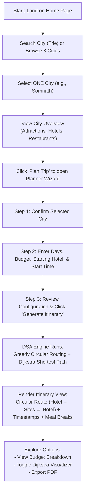

# Software Requirements Specification (SRS)

## Project Title: Heritage Tourism Planner for Gujarat
**Course:** CSC210 Data Structures & Algorithms — Ahmedabad University  
**Group:** Group 07  
**Status:** Baseline Specification (Verified Against Frontend Implementation)

---

## 1. Scope Statement

The **Heritage Tourism Planner for Gujarat** operates strictly on an **intra-city scope**. The user selects **one city at a time** from 8 fixed Gujarat heritage destinations (*Somnath, Dwarka, Rann of Kutch, Gir, Modhera, Champaner, Saputara, Ahmedabad*). Upon city selection, the system generates a **circular, intra-city, multi-day itinerary**:

$$\text{Hotel} \longrightarrow \text{Attraction}_1 \longrightarrow \text{Attraction}_2 \longrightarrow \cdots \longrightarrow \text{Hotel}$$

Each generated itinerary includes exact minute-by-minute arrival/departure timestamps, automatic meal-break insertion (lunch and dinner), hotel selection, and an itemized budget breakdown. 

**There is no inter-city routing anywhere in this system.** Travel between different cities is left entirely to the user. Every requirement, user story, use case, flow, and acceptance criterion in this document adheres strictly to this intra-city boundary.

---

## 2. Functional Requirements

| Requirement ID | Module / Area | Feature Description | Input / Trigger | System Action / Output |
| :--- | :--- | :--- | :--- | :--- |
| **FR-01** | Authentication | User Registration | Select role (Tourist or Tour Operator), name, email, password | Creates user account with specified role in system state |
| **FR-02** | Authentication | User Login | Email and password credentials | Authenticates user and sets active session state (Tourist vs. Tour Operator) |
| **FR-03** | Exploration | Explore / Browse Cities | Select "Explore" tab | Displays grid of 8 heritage cities with photos, districts, and categories |
| **FR-04** | Search | City Search Filter | Type string into search input | Filters displayed cities matching query (Trie-backed search specification) |
| **FR-05** | Search | Prefix Autocomplete | Type 1+ characters (e.g., `"Dw"`) | Displays dropdown with matching city/attraction names in $O(L)$ time |
| **FR-06** | Exploration | City Overview | Click on a city card | Displays city overview showing its 4 attractions, 3 hotels, and 3 restaurants |
| **FR-07** | Recommendations | Attraction Discovery | View city detail page | Displays categorized local attractions with entry fees, durations, and ratings |
| **FR-08** | Recommendations | Hotel Recommendations | View hotels tab or step 2 wizard | Ranks local hotels by rating-to-price ratio and price tier |
| **FR-09** | Trip Planner | Create Intra-City Trip | Click "Plan Trip" on a city | Opens 3-step trip planner wizard scoped strictly to that city |
| **FR-10** | Trip Planner | Trip Duration Selection | Wizard Step 2: input number of days | Sets trip length ($1, 2, \text{ or } 3$ days) for daily time-budget split |
| **FR-11** | Trip Planner | Budget Limit Input | Wizard Step 2: input budget (₹) | Sets total financial limit for hotel, entry fees, meals, and transit |
| **FR-12** | Trip Planner | Starting Hotel Selection | Wizard Step 2: select hotel | Assigns the hotel node as the circular route start and end point |
| **FR-13** | Trip Planner | Trip Start Time Input | Wizard Step 2: time input (default `08:00`) | Sets daily departure time from hotel for timestamp calculations |
| **FR-14** | Itinerary Generator | Circular Itinerary Execution | Wizard Step 3: click "Generate Itinerary" | Executes Greedy nearest-neighbor & Dijkstra pathfinding for daily circular route |
| **FR-15** | Itinerary Generator | Automatic Meal Insertion | Internal schedule clock crossing dining window | Automatically inserts 60-min Lunch (12:30–14:30) or Dinner (19:30–21:30) stops |
| **FR-16** | Budget Planner | Financial Breakdown | Generated trip state | Calculates total cost across Hotels, Entry Fees, Meals, and Transit vs. Budget |
| **FR-17** | Itinerary View | Circular Route & Timestamp View | View generated itinerary tab | Displays minute-by-minute ordered stop list and visual route map starting/ending at hotel |
| **FR-18** | Visualizer | Dijkstra Algorithm Animation | Toggle "Show Algorithm" in Itinerary View | Renders interactive step-by-step node relaxation and shortest-path tree construction |
| **FR-19** | CMS Admin | Tour Operator CRUD | Admin Dashboard tab (Tour Operator role) | Allows adding, editing, and deleting cities, attractions, hotels, and restaurants |
| **FR-20** | Trip Planner | Hotel Selection Validation | Wizard Step 2 dropdown | Restricts starting hotel choices strictly to hotels within the chosen city |
| **FR-21** | Trip Planner | Start Time Defaulting | Wizard Step 2 initialization | Defaults daily tour start time to `08:00 AM` if unedited |
| **FR-22** | Itinerary View | Meal Break Visual Distinction | Render itinerary stop item | Displays meal stops with distinct styling (e.g., gold cutlery badge) separate from attractions |

---

## 3. Non-Functional Requirements (NFRs)

| NFR Category | Metric / Specification | Specific Project Implementation Context |
| :--- | :--- | :--- |
| **Performance** | Response Time $< 100\text{ ms}$ | Itinerary generation (Greedy + Dijkstra fallback) for a 4–6 node intra-city graph completes in under 1 second on the client frontend. |
| **Scalability** | Graph Expansion | Schema and DSA engine support adding up to 50 attractions per city without requiring architectural redesign. |
| **Usability** | WCAG AA Compliance | Contrast ratio $\ge 4.5:1$ across all text elements (including Stone Grey `#6B665B`); keyboard navigation with Stepwell Gold focus outlines. |
| **Reliability** | Deterministic Results | Given identical inputs (city, days, budget, hotel, start time), the itinerary generator produces 100% deterministic outputs. |
| **Security** | Role-Based Access Control | Standard JWT authentication restricting Tour Operator CMS actions (`POST/PUT/DELETE`) strictly to verified operator accounts. |
| **Maintainability** | Modular Architecture | DSA modules (Trie, Graph, Dijkstra, Priority Queue, Greedy) are isolated pure TypeScript functions decoupled from React UI components. |
| **Availability** | Client-Side Resiliency | Static data fallback ensures 99.9% uptime for offline/mock exploration modes when backend connectivity is unavailable. |
| **Data Consistency** | Relational Integrity | Foreign key constraints enforce that every attraction, hotel, and route belongs strictly to an existing city entity (`destination_id`). |

---

## 4. User Stories

### Tourist Stories
1. **US-01 (City Exploration):** *As a tourist*, I want to browse and search Gujarat's heritage cities by typing name prefixes so that I can quickly find my destination.
2. **US-02 (Intra-City Trip Configuration):** *As a traveler*, I want to select a single city, my preferred starting hotel, total trip duration, and daily start time so that my plan fits my schedule.
3. **US-03 (Circular Itinerary Generation):** *As a tourist*, I want a minute-by-minute daily plan that starts and ends at my chosen hotel so that I don't have to figure out daily return travel.
4. **US-04 (Automated Meal Schedule):** *As a family traveler*, I want lunch and dinner breaks automatically inserted into my day plan so that we don't skip meals while sightseeing.
5. **US-05 (Budget Tracking):** *As a budget traveler*, I want a detailed breakdown of hotel, entry fee, meal, and transit costs against my budget so that I don't overspend.
6. **US-06 (Dijkstra Visualization):** *As a student/tourist*, I want to toggle an algorithm visualizer to see how shortest path calculations connect non-adjacent attractions in the city graph.

### Tour Operator Stories
7. **US-07 (Operator CMS Access):** *As a local tour operator*, I want to log in with an operator account so that I can access the Admin Dashboard.
8. **US-08 (Attraction & Hotel Management):** *As a tour operator*, I want to add, update, or remove hotels, attractions, and restaurants in my city so that travelers see accurate listings.

---

## 5. Use Case Specification & Diagram

```mermaid
usecaseDiagram
    actor Tourist as "Tourist"
    actor Operator as "Tour Operator"

    package "Heritage Tourism Planner (Intra-City System)" {
        usecase UC1 as "Search / Autocomplete City (Trie)"
        usecase UC2 as "View City Details & Attractions (Hash Table)"
        usecase UC3 as "Configure Intra-City Trip (Days, Budget, Hotel, Start Time)"
        usecase UC4 as "Generate Circular Day Itinerary (Greedy + Dijkstra)"
        usecase UC5 as "View Budget Breakdown"
        usecase UC6 as "View Dijkstra Algorithm Visualization"
        usecase UC7 as "Manage City Listings & Data (Admin CMS)"
    }

    Tourist --> UC1
    Tourist --> UC2
    Tourist --> UC3
    Tourist --> UC4
    Tourist --> UC5
    Tourist --> UC6

    Operator --> UC1
    Operator --> UC2
    Operator --> UC7
```

---

## 6. User Flow



---

## 7. Acceptance Criteria

### AC-01: City Search & Autocomplete
- **Given** the user is on the Explore view or search input,
- **When** the user types a prefix (e.g., `"Som"` or `"Dwa"`),
- **Then** matching cities are displayed instantly in an autocomplete dropdown within $< 50\text{ ms}$.

### AC-02: Circular Route Completeness
- **Given** a generated daily itinerary for a selected city,
- **When** reviewing the ordered stop list for any trip day,
- **Then** Day 1 must start at the user's selected starting hotel (`Departure`) and end at the exact same hotel (`Return`).

### AC-03: Automatic Meal-Break Insertion
- **Given** a day schedule in progress,
- **When** the cumulative schedule clock reaches the lunch window (12:30 PM – 2:30 PM) or dinner window (7:30 PM – 9:30 PM),
- **Then** the engine automatically inserts a 60-minute meal stop, updates arrival/departure times, and visually distinguishes the meal card from attraction cards.

### AC-04: Budget Breakdown Accuracy
- **Given** a generated trip with hotel stay, entry fees, and meal expenses,
- **When** viewing the Budget Breakdown component,
- **Then** the sum of $(\text{Hotel Cost} + \text{Entry Fees} + \text{Meals} + \text{Transit})$ must equal total projected expenditure and alert if exceeding budget.

---

## 8. Intra-City Edge Cases & Failure Handling

| Edge Case ID | Scenario | System Behavior & Failure Handling |
| :--- | :--- | :--- |
| **EC-01** | City with only 1–2 attractions | Planner schedules available attractions on Day 1 and informs user that all city highlights have been visited. |
| **EC-02** | Trip duration exceeds attraction fill capacity | If trip duration (e.g., 3 days) exceeds available attractions, remaining days are allocated for leisure/cultural shopping at local markets without breaking. |
| **EC-03** | Budget too low for minimum hotel + 1 attraction | System highlights budget deficit in Step 2 of wizard and recommends minimum required budget or lower-tier homestays. |
| **EC-04** | Disconnected intra-city graph (No road path between 2 nodes) | Dijkstra returns $\infty$ distance; Greedy engine skips un reachable node, logs warning, and routes to next reachable attraction. |
| **EC-05** | Late daily start time (e.g., 5:00 PM) | Planner skips lunch break window, inserts dinner break at 7:30 PM, and caps evening schedule at reasonable return hour. |
| **EC-06** | Empty search query input | Search input returns all 8 default heritage cities sorted alphabetically without throwing errors. |
| **EC-07** | Selected starting hotel removed mid-session | System falls back to default city heritage hotel (e.g., Toran Hotel) and alerts user to re-confirm stay choice. |
| **EC-08** | Duplicate attraction selection in wizard | System de-duplicates attraction IDs using a Set data structure during itinerary initialization. |
| **EC-09** | Invalid trip parameters (e.g., 0 days or negative budget) | Form validation blocks wizard progression and displays inline error message ("Trip duration must be between 1 and 3 days"). |
