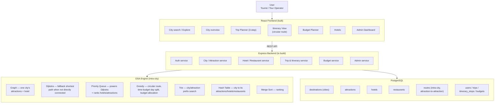
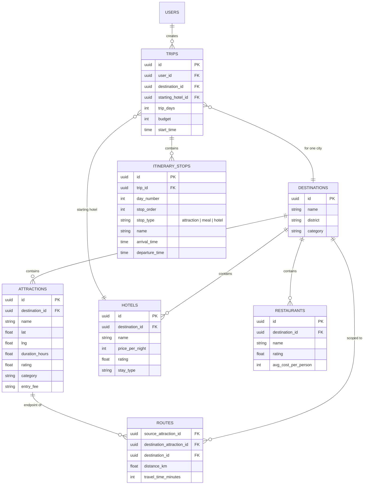

# System Architecture — Heritage Tourism Planner for Gujarat

Course: CSC210 Introduction to Data Structures & Algorithms — Ahmedabad University  
Status: Frontend built and verified. Backend not yet started.

---

## 1. Scope statement (read this before anything else below)

The user selects **one city at a time** from 8 fixed options (Somnath, Dwarka, Rann of Kutch, Gir, Modhera, Champaner, Saputara, Ahmedabad) and gets a **circular, intra-city, multi-day plan**: hotel → attractions → back to the same hotel, with real arrival/departure times and automatic meal-break insertion. **There is no inter-city routing anywhere in this system** — travel between cities is left entirely to the user. Every diagram, table, and algorithm description in this document assumes this scope. Earlier drafts of this project assumed multi-city inter-city itineraries; that scope was deliberately dropped because a full Gujarat-wide road/distance dataset was impractical to source, and the corrected scope produces a cleaner DSA story besides (Greedy drives the route; Dijkstra becomes a genuine supporting algorithm rather than window dressing).

---

## 2. High-level architecture



**The one sentence a professor should be able to say after seeing this diagram:** "The DSA engine sits between the backend services and the database, and every box in it maps to a specific, named feature — not decoration."

---

## 3. DSA architecture (the core academic artifact)

| DSA / Algorithm | Scope | Role | Why this and not an alternative |
|---|---|---|---|
| **Graph** | One city's attractions + its hotel(s) as nodes; direct roads as edges | Represents the intra-city road network the day's route runs on | Weighted, undirected — road distance is naturally symmetric and non-negative |
| **Dijkstra** | Within one city only | Fallback: computes shortest path between two attractions ONLY when they aren't directly road-connected | Guarantees shortest path for non-negative weights; used sparingly since most attraction pairs in a small city graph ARE directly connected |
| **Priority Queue (min-heap)** | Two uses | (1) Powers Dijkstra's next-node selection; (2) ranks hotels/attractions by rating-per-cost for recommendations | Reusable as one generic Min-Heap class with a swappable comparator, not two separate implementations |
| **Greedy** | Within one city | (1) Builds the day's circular visiting order via nearest-neighbor; (2) splits attractions across multiple days by remaining TIME BUDGET, not a fixed count; (3) allocates the money budget across hotel + attractions + meals, prioritizing by rating within limits | Fast, explainable, appropriate at this input size (4-6 attractions/city); explicitly documented as NOT globally optimal — this is a deliberate research discussion point, not a gap we're hiding |
| **Trie** | All 8 cities' names + all attraction names | Prefix-based autocomplete search ("Dw" → "Dwarka") | O(L) prefix traversal, far better than scanning/filtering on every keystroke |
| **Hash Table** | City → its attractions/hotels/restaurants | Instant O(1) average lookup once a city is confirmed — this is explicitly a lookup/index structure, not a restatement of "the database has an index" | Distinguishes "search" (Trie, fuzzy/prefix) from "confirmed lookup" (Hash Table, exact) as two different operations with two different structures |
| **Merge Sort** | Hotels, attractions, destinations | Ranking by price/rating/distance for display | O(n log n); implemented manually for the DSA demonstration, not just `Array.prototype.sort()` |

### What Dijkstra does NOT do
It does not generate the itinerary. It does not choose which attractions to visit. It only answers: "given two attractions in this city that aren't directly connected, what's the shortest path between them through intermediate points?" Greedy is the itinerary-building algorithm; Dijkstra is a utility it calls when needed.

---

## 4. Backend module breakdown

```
backend/
├── routes/
│   ├── authRoutes.js
│   ├── destinationRoutes.js      # cities
│   ├── attractionRoutes.js
│   ├── hotelRoutes.js
│   ├── restaurantRoutes.js
│   ├── tripRoutes.js             # itinerary generation lives here
│   ├── budgetRoutes.js
│   └── adminRoutes.js
├── services/
│   ├── itineraryService.js       # calls dsa/greedy + dsa/dijkstra
│   ├── searchService.js          # calls dsa/trie
│   └── lookupService.js          # calls dsa/hashTable
├── dsa/
│   ├── graph/
│   ├── dijkstra/
│   ├── priorityQueue/
│   ├── trie/
│   ├── hashTable/
│   ├── greedy/
│   └── sorting/
├── models/
├── middleware/
└── config/
```

### Representative API endpoints

| Method | Endpoint | Purpose |
|---|---|---|
| GET | `/api/destinations` | List all 8 cities |
| GET | `/api/destinations/search?prefix=` | Trie-backed city name autocomplete |
| GET | `/api/destinations/:id` | City overview (Hash Table lookup) |
| GET | `/api/destinations/:id/attractions` | That city's attractions |
| GET | `/api/destinations/:id/hotels?sort=` | That city's hotels, ranked |
| POST | `/api/trips` | Create a trip (city, days, budget, starting hotel, start time) |
| POST | `/api/trips/:id/generate-itinerary` | Runs Greedy (+ Dijkstra where needed) |
| GET | `/api/trips/:id/budget` | Budget breakdown |
| POST/PUT/DELETE | `/api/admin/{destinations|hotels|attractions|restaurants}/:id` | Tour Operator CRUD |

---

## 5. Database schema (corrected for intra-city scope)



**Note on `ROUTES`:** this table is intentionally scoped to attraction-to-attraction pairs **within a single city** — it is not a city-to-city table. There is no `destinations ↔ destinations` many-to-many relationship anywhere in this schema, by design.

---

## 6. Frontend ↔ Backend mapping

| Frontend view (already built) | Backend dependency |
|---|---|
| Explore / city search | `GET /destinations/search` (Trie) |
| City overview | `GET /destinations/:id`, `/attractions`, `/hotels` (Hash Table) |
| Trip Planner wizard | `POST /trips` |
| Itinerary View (circular route, times, meal breaks) | `POST /trips/:id/generate-itinerary` (Greedy + Dijkstra) |
| "Show algorithm" Dijkstra visualizer | Same intra-city graph data, or a dedicated debug endpoint |
| Budget Planner | `GET /trips/:id/budget` |
| Hotels | `GET /destinations/:id/hotels?sort=` (Priority Queue ranking) |
| Admin Dashboard | CRUD endpoints, Tour Operator role only |

The frontend is fully built against mock data matching these shapes already — see `Frontend_Documentation.md`. Wiring is a drop-in replacement of mock calls with real `fetch`s, not a redesign.

---

## 7. Non-functional requirements

| Category | Requirement |
|---|---|
| Performance | Itinerary generation (Greedy + occasional Dijkstra calls) returns in well under 1 second for a 4-6 node city graph |
| Scalability | Schema and DSA structures support adding more cities/attractions without redesign |
| Security | JWT auth, role-based access (Tourist vs. Tour Operator) for admin routes |
| Reliability | Itinerary and budget calculations are deterministic — same inputs, same output |
| Accessibility | Frontend already meets this bar (see Frontend_Documentation.md §6) — backend must not require frontend regressions to integrate |

---

## 8. Deployment (planned)

| Layer | Target |
|---|---|
| Frontend | Vercel |
| Backend | Render |
| Database | Managed PostgreSQL (Render or equivalent) |

---

*This document is the corrected, current-state master architecture. It supersedes any earlier architecture description that assumed inter-city routing or a city-to-city graph.*
