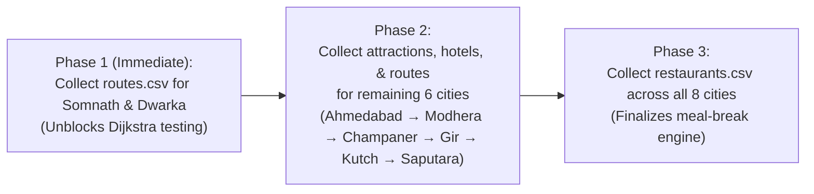

# Data Collection Plan — Heritage Tourism Planner for Gujarat

**Course:** CSC210 Data Structures & Algorithms — Ahmedabad University  
**Group:** Group 07  
**Status:** Active Implementation Plan & Data Engineering Standard

---

## 1. Scope & Relational Boundaries

> [!IMPORTANT]
> **Intra-City Scope Reminder:** All data collection operates **strictly inside single city boundaries**. 
> - The `routes.csv` dataset records road travel times and distances between **attractions within the same city** (e.g., *Somnath Temple* to *Triveni Sangam* in Somnath).
> - **No inter-city travel or distance data is collected.** Travel between cities is left to the user and is out of scope for this system.

---

## 2. Current Data Inventory & Audit Status

| Destination City | Attractions Data Status | Hotels Data Status | Restaurants Data Status | Intra-City Routes Data Status |
| :--- | :--- | :--- | :--- | :--- |
| **Somnath** | Verified Real Data | Sourced & Cited (Holidify/Momondo) | Placeholder / Estimated | **Missing (Urgent)** |
| **Dwarka** | Verified Real Data | Sourced & Cited (Holidify/Momondo) | Placeholder / Estimated | **Missing (Urgent)** |
| **Ahmedabad** | Mock / Estimated | Mock / Estimated | Placeholder / Estimated | **Missing** |
| **Modhera** | Mock / Estimated | Mock / Estimated | Placeholder / Estimated | **Missing** |
| **Champaner** | Mock / Estimated | Mock / Estimated | Placeholder / Estimated | **Missing** |
| **Gir** | Mock / Estimated | Mock / Estimated | Placeholder / Estimated | **Missing** |
| **Rann of Kutch** | Mock / Estimated | Mock / Estimated | Placeholder / Estimated | **Missing** |
| **Saputara** | Mock / Estimated | Mock / Estimated | Placeholder / Estimated | **Missing** |

---

## 3. Required Datasets & Schemas

### 3.1. `attractions.csv` (Target: 6–10 per City)
Stores points of interest, realistic visit durations, entry fees, and geographic coordinates.

```csv
attraction_id,destination_id,name,category,latitude,longitude,entry_fee,average_visit_duration_hours,opening_time,closing_time,rating,source
```

### 3.2. `routes.csv` (Intra-City Only — Most Urgent Dataset)
Stores actual road travel distances (km) and estimated drive/transit times (minutes) between directly connected intra-city attraction pairs.

```csv
source_attraction_id,destination_attraction_id,destination_id,distance_km,travel_time_minutes,source
```

### 3.3. `hotels.csv` (Target: 3–5 per City)
Stores accommodation options categorised by stay type, price per night, and rating.

```csv
hotel_id,destination_id,hotel_name,price_per_night,rating,stay_type,latitude,longitude,source
```

### 3.4. `restaurants.csv` (Target: 2–4 per City)
Stores local dining options used by the automatic meal-break schedule generator.

```csv
restaurant_id,destination_id,name,latitude,longitude,rating,avg_cost_per_person,source
```

---

## 4. Data Dictionary

| Dataset | Field Name | Data Type | Constraint / Rule | Required? | Purpose |
| :--- | :--- | :--- | :--- | :--- | :--- |
| `attractions` | `attraction_id` | `UUID / String` | Unique identifier | Yes | Entity key |
| `attractions` | `destination_id` | `String` | Foreign key to city | Yes | City scoping |
| `attractions` | `name` | `String` | Full official name | Yes | Display & search |
| `attractions` | `category` | `String` | Temple / Fort / Nature / Museum | Yes | Recommendation filter |
| `attractions` | `latitude` | `Decimal` | $-90.0 \text{ to } +90.0$ | Yes | Map plotting |
| `attractions` | `longitude` | `Decimal` | $-180.0 \text{ to } +180.0$ | Yes | Map plotting |
| `attractions` | `entry_fee` | `String` | Text description (e.g. `"Free"`, `"₹50"`) | Yes | Budget tracking |
| `attractions` | `average_visit_duration_hours` | `Decimal` | $> 0.0$ (e.g. `1.5`, `3.0`) | Yes | Time budget split |
| `attractions` | `opening_time` | `Time (HH:MM)` | 24-hour format | Yes | Opening window |
| `attractions` | `closing_time` | `Time (HH:MM)` | 24-hour format | Yes | Closing window |
| `attractions` | `rating` | `Decimal` | $0.0 \text{ to } 5.0$ | Optional | Recommendation score |
| `routes` | `source_attraction_id` | `String` | FK to `attractions` | Yes | Graph edge origin |
| `routes` | `destination_attraction_id` | `String` | FK to `attractions` | Yes | Graph edge target |
| `routes` | `destination_id` | `String` | FK to `destinations` | Yes | Denormalized city key |
| `routes` | `distance_km` | `Decimal` | $> 0.0$ (Road distance) | Yes | Distance weight |
| `routes` | `travel_time_minutes` | `Integer` | $> 0$ (Road transit time) | Yes | Graph edge weight |
| `hotels` | `hotel_id` | `String` | Unique identifier | Yes | Entity key |
| `hotels` | `stay_type` | `Enum` | Toran / Heritage / Registered / Homestay | Yes | Hotel filtering |
| `hotels` | `price_per_night` | `Integer` | $\ge 0$ | Yes | Budget calculation |
| `restaurants`| `avg_cost_per_person` | `Integer` | $\ge 0$ | Yes | Meal cost calculation |

---

## 5. Non-Negotiable Data Quality & Cleaning Rules

1. **No Fabrication:** Never invent plausibly-sounding prices, distances, or ratings. Mark missing values explicitly as `UNVERIFIED -- estimate`.
2. **Road Distances Only:** Intra-city distances must be measured using Google Maps road routing ("Measure distance" or "Directions"), never straight-line Euclidean distance.
3. **Missing Value Handling:**
   - Missing `rating`: Exclude from priority queue rating-per-cost rankings; do **not** default to `0.0`.
   - Missing `entry_fee`: Default to `"Free"` if verified zero, or `"UNVERIFIED"` if unconfirmed.
4. **Source Attribution:** Every entry must record a primary source string (e.g., `Google Maps 2026-08-20`, `Gujarat Tourism Official 2026`).

---

## 6. Sample Rows (Unverified Samples Marked)

### `attractions.csv` Sample
```csv
attraction_id,destination_id,name,category,latitude,longitude,entry_fee,average_visit_duration_hours,opening_time,closing_time,rating,source
a101,somnath,Somnath Temple,Temple,20.888000,70.401200,Free,1.5,06:00,21:00,4.9,Gujarat Tourism Official 2026
a301,ahmedabad,Sabarmati Ashram,Heritage,23.060500,72.580700,Free,1.5,08:30,18:30,4.7,SAMPLE -- Google Maps 2026
```

### `routes.csv` Sample (Intra-City Only)
```csv
source_attraction_id,destination_attraction_id,destination_id,distance_km,travel_time_minutes,source
a101,a103,somnath,2.0,8,Google Maps Directions 2026-08-20
a101,a104,somnath,1.2,5,Google Maps Directions 2026-08-20
```

---

## 7. Execution Prioritization & Phases



---

## 8. Versioning & Provenance Tracking

- **Location:** `frontend/src/data/CHANGELOG.md`
- **Rule:** Any additions or edits to CSV datasets must log the date, city updated, fields changed, and contributor name.
